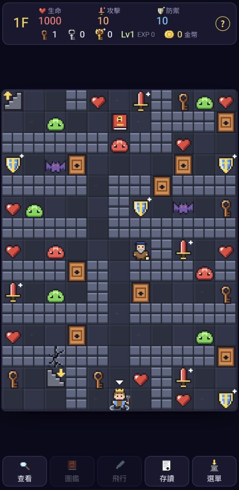

# 魔塔：失落的旋律（Magic Tower: The Lost Melody）

經典「魔塔」的網頁版。20 層原創關卡＋一層隱藏層、四隻大型 Boss、中文／English／日本語，手機和電腦的進度可以透過你自己的私有 GitHub repo 同步。

**直接玩**：https://agan0617.github.io/MagicTower/

## 故事

里拉王國是音樂之國。15 歲的王子**阿爾特**從小就是豐收祭合唱團的領唱，今年卻開始變聲，練唱時破音被全場笑，從此躲進王宮後面的打鐵鋪敲鐵，老鐵匠叫他「**小鐵**」。豐收祭前一晚，國王又來唸他，他吼了一句「全部都給我閉嘴！」——戴面具的「靜默指揮家」從他的影子裡站起來，把全國的聲音都捲進了一座漆黑的高塔。

跟著豐收祭之歌的精靈**多蕾**爬上靜默之塔，把音樂一樣一樣搶回來。一路上遇到的，其實都是他自己：5F 的鼓魔像是**怒氣**、10F 的弦之魔女是**別人的眼光**、15F 的回音之鏡是**一直拿現在跟小時候比的那個他**、塔頂的指揮家是**想把所有聲音關掉的那個他**。

- **音樂會跟著劇情回來**：一開始塔裡只剩低音和零星的鐘聲；打倒 5F 的鼓魔像，鼓聲回到配樂裡；打倒 10F 的弦之魔女，和聲回來；打倒 15F 的回音之鏡，笛聲回來；結局時整首豐收祭之歌全員到齊
- 沿路撿到一本《不知道是誰的日記》的三頁，寫的是另一個十五歲王子摔門、說不出對不起、破音後發誓不再唱歌的事
- **兩種結局**：三頁日記全部撿齊、再找回藏在塔裡的「失落的音符」，打倒指揮家後就會看到真結局；少一樣是一般結局（結局畫面會給提示）
- 所有音樂和音效都用 Web Audio 即時合成，沒有任何音檔；美術全是程式裡的像素圖

## 玩法

經典魔塔規則：遇敵開戰後，阿爾特和怪物輪流攻擊，直到一方倒下，戰鬥結果是固定的，所以**打之前就知道會損失多少生命**。一進塔就會撿到《怪物圖鑑》，之後，地圖上每隻怪腳下會標出代價，紅色代表打不贏；沒有圖鑑之前看不到怪物的能力。

資源永遠不夠用：鑰匙比門少、錢和經驗值只夠買一部分的強化，**先開哪扇門、先打哪隻怪、錢花在哪裡**決定你能不能打到最上面、剩多少血。

- **鑰匙**分銅、銀、金三級，各開同材質的門；紅色小劍＋攻擊、藍色小盾＋防禦、愛心＋生命（金邊大愛心加得多）
- **金幣**：4F、11F、16F 的祭壇換能力（每買一次漲價）；6F 的呱呱商人賣鑰匙；13F 他的表哥只收不賣，用不完的銀、金鑰匙可以賣給他（6F 價格的一半）
- **經驗值**：打怪會得到，3F 的節拍之神（13F 有進階版）用經驗值換等級
- **技能**：打倒 10F 的弦之魔女後，三種唱法選一種——沉穩低音（被打少受傷）、回音（把傷害彈回去）、連音（每回合多打一下）。要先到 12F 找老琴師鑑定才會生效，等級夠了再找他還能升級兩次
- **怪物特技**：先攻、連擊、魔法（無視防禦）、破甲（防禦只算一半）、吸血（開打前吸走目前生命的一部分，血少的時候打比較划算）、夾擊（走進兩隻夾擊怪中間會失去 1/3 生命）、共鳴（16F 起的共鳴水晶：走進牠周圍八格，每一步失去 80 生命）；Boss 和中 Boss 佔 3×3 或 2×2 格
- **回音地板**：11～15F 地上有一圈圈青色波紋的格子，踩上去，這層上一場戰鬥損失的生命會再扣一次，踩過就散掉。地上的數字是現在踩要扣多少，所以踩之前最後打的那隻要挑便宜的
- **共鳴水晶**：守在路口，範圍是周圍八格（粉紅色虛線框）。可以每次經過付一次，也可以打掉牠；剛到 16F 打牠要一千多血，攻擊堆上去之後只要幾百
- **風之羽**：9F 的信差鴿子送來，可以在去過的樓層之間飛行。Boss 還活著的樓層飛不走
- **裂牆與暗牆**：有裂痕的牆用鑿子敲得開（鑿子比裂牆少，要挑）；有些看起來普通的牆其實走得過去，後面是隱藏房間，還有一整層隱藏層
- **路上的 NPC**：有的給提示、有的送東西、有的要跟你做一筆交易，記得都去聊聊
- 記得常常存檔（每台裝置一格自動存檔＋最多 99 格手動存檔）
- **通關評價 S／A／B／C**：看通關時剩多少生命，剩下的金幣、鑰匙、經驗值也會照祭壇和節拍之神的價格換成生命算進去。S 要真結局才拿得到；遊玩時間和步數不影響評價。標題畫面會顯示所有裝置裡最好的一次

操作（每層地圖寬 11 格、高 15 格）：

- **點地圖上的格子**，勇者會沿著畫出來的虛線走過去，終點有框標示；走到一半點別的地方就改走新路線。優先走空地，沒有空路才會順路撿道具。點到走不到的地方，那格會閃一下紅色 ✕
- **點怪物或門**就直接走過去開打、開門。打不贏的怪、打不動的怪、沒鑰匙的門會擋下來並告訴你原因
- **長按怪物、道具、門、樓梯、NPC**都會跳說明卡（怪物是能力和預估戰鬥後生命損失，跟圖鑑同一列；門是要用哪把鑰匙和身上有幾把、道具是撿起來加多少），再點一下任何地方收起來
- **查看**（下方功能鍵第一顆）：按下去變黃色、地圖框變淡黃，這時點一下就跳同一張說明卡、不會移動；再按一次「查看」、`Esc`、返回鍵或方向鍵離開
- 電腦也可以用方向鍵／WASD 走；`B` 圖鑑、`F` 飛行、`Shift+S` 存讀、`Esc` 選單（查看模式中是離開查看模式）
- 第一次玩可以按標題畫面的**教學**（遊戲中在**選單 → 教學**）：8 頁圖文說明，從移動、戰鬥怎麼算、鑰匙與門，到怪物特技和小技巧

## 手機和電腦同步進度

做法跟 [K書吧](https://github.com/agan0617/KBookBar) 一樣：進度存在**你自己的私有 repo** 裡的 `saves/magictower/saves.json`，每台裝置貼一次 GitHub fine-grained token，瀏覽器／App 直接跟 GitHub API 對話，沒有任何中間伺服器。

一個私有 repo 可以同時給好幾個 App 當雲端存檔，**一支 token 全部通用**，不用每個 App 各建一個 repo、各產生一支 token。每個 App 只讀寫 `saves/` 底下自己的位置，互不干擾，目錄也是 App 自己建的：

| App | 存在 repo 的哪裡 |
|---|---|
| [K書吧](https://github.com/agan0617/KBookBar) | `saves/kbookbar/`（書目、書檔、閱讀進度） |
| [魔塔](https://github.com/agan0617/MagicTower) | `saves/magictower/`（存檔） |

已經在其中一個 App 連上的話，其他 App 連線時貼同一支 token、repo 填同一個就好。

1. 建一個 **Private** repo（預設名稱 `CloudSave`，勾 Add a README file）
2. 到 GitHub → Settings → Developer settings → Personal access tokens → **Fine-grained tokens** → Generate new token：Repository access 只選那個 repo，Permissions 的 **Contents** 設成 **Read and write**
3. 遊戲裡開存檔頁、按最下面的「雲端同步」（或標題畫面的「雲端同步」）→ 貼上 token → repo 填 `你的帳號/你的 repo` → 連線

同步規則跟K書吧的進度格一樣：存檔是一條清單，**每台裝置只寫自己的格子**，所以手機和電腦不會互相蓋掉。每台裝置各有一格自動存檔；手動存檔所有裝置共用、新的在前、最多 99 格（滿了再存會擠掉最舊的），別台裝置存的只能讀不能覆蓋。「繼續遊戲」接的是所有裝置裡最新的自動存檔。每次換樓層、打完 Boss、買東西都會自動存檔並在幾秒內上傳；切走 App 或關掉分頁時也會上傳。打開時如果別台裝置有比較新的進度，會問你要不要讀取。

token 只存在那台裝置的瀏覽器（localStorage）裡；手機弄丟時到 GitHub 把 token 刪掉就好。

## 檔案

| 檔案 | 內容 |
|---|---|
| `js/data.js` | 20 層＋隱藏層的地圖、怪物、道具、NPC、商店、劇本 |
| `js/core.js` | 規則：移動、戰鬥試算、技能、等級、撿道具、開門、劇本的狀態指令、通關評價（不碰畫面，node 也能跑） |
| `js/sprites.js` | 像素圖（字元圖，可換色；一般 16×16，大型 Boss 24×24） |
| `js/audio.js` | 音樂與音效合成、分層配樂 |
| `js/i18n.js` | 三語的介面與劇情文字 |
| `js/sync.js` | 本機存檔與 GitHub 同步 |
| `js/main.js` | 畫面、操作、演出、選單 |
| `DESIGN.md` | 關卡設計規則、機制、平衡流程 |
| `tools/sim.js` | 自動玩家（新手／一般／真人型／高手）的共用程式 |
| `tools/solve.js` | 平衡檢查：四種自動玩家各打一次，看打不打得通、分數差多少；真人型可以換亂數種子跑很多次看分佈 |
| `tools/audit.js` | 關卡稽核：白開的房間、多餘的門、擋路的 NPC、樓梯岔路、左右內容重複、白踩的回音地板…（`--sim` 再看攻防價值比） |
| `tools/check_reach.js` | 地圖連通檢查：每層有沒有永遠走不到的格子 |
| `tools/rooms.js` | 印出一層的區域與相連的門、怪（設計關卡用） |
| `tools/show.js` | 印出一層地圖與怪物代價 |
| `tools/count.js` | 每層的鑰匙／門／寶石數量 |
| `tools/make_icons.py` | 產生圖示 |

改版時記得把 `sw.js` 的 `VERSION` 加一，否則已經開過的瀏覽器會繼續用快取裡的舊檔。
